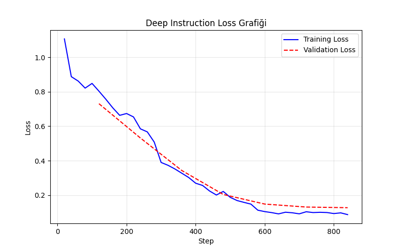
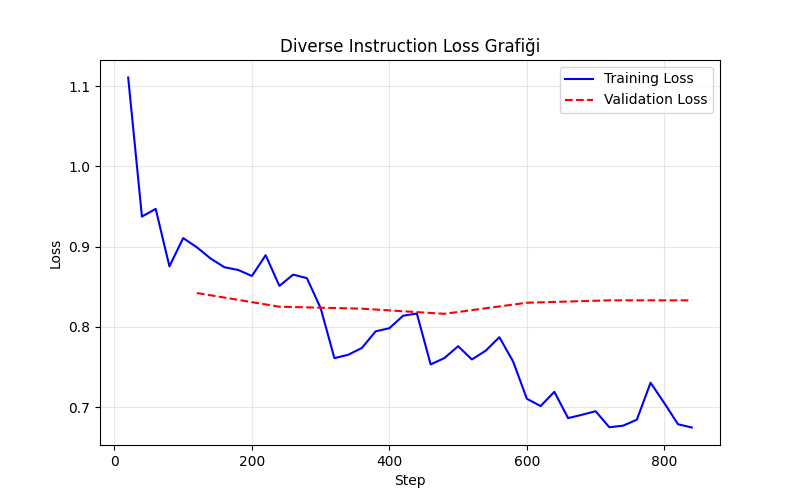

# NLP LoRA Fine-Tuning Project: Code Generation with Qwen 2.5

This project focuses on fine-tuning the **Qwen 2.5 Coder 1.5B Instruct** model using **LoRA (Low-Rank Adaptation)** to improve its Python code generation capabilities. We trained two separate models using different datasets: **Deep Instruction** and **Diverse Instruction**.

**Result:** On the 41 AtCoder Easy problems reported below, the base model solved 17/41 and each fine-tuned checkpoint solved 14/41. The experiment is useful for examining dataset fit and overfitting, but it did not improve this benchmark.

The training scripts load [CodeGen-Deep-5K](https://huggingface.co/datasets/naholav/CodeGen-Deep-5K) and [CodeGen-Diverse-5K](https://huggingface.co/datasets/naholav/CodeGen-Diverse-5K). The full project report is available in [NLP-Report.pdf](NLP-Report.pdf).

## 📂 Project Files

* `train_deep.py`: Training script for the Deep dataset.
* `train_diverse.py`: Training script for the Diverse dataset.
* `eval.py`: Benchmark script for fine-tuned models.
* `eval_base.py`: Benchmark script for the Base model.
* `deep_training_log.json`: Training loss logs for Deep model.
* `diverse_training_log.json`: Training loss logs for Diverse model.
* `deep_loss.png`: Training/Validation loss visualization for Deep model.
* `diverse_loss.png`: Training/Validation loss visualization for Diverse model.
* `requirements.txt`: List of dependencies.

## 📊 Performance Analysis

### 1. Loss Graphs & Overfitting Analysis

We monitored **Training Loss** and **Validation Loss** to evaluate learning progress and detect overfitting.

#### **Deep Instruction Model**


* **Observation:** The training loss consistently decreased from ~0.96 to ~0.19.
* **Analysis:** The model learned the training data very well. However, the validation loss plateaued (stopped improving) after Step 600, indicating mild overfitting. The model remained relatively stable throughout the process.

#### **Diverse Instruction Model**


* **Observation:** While training loss dropped sharply, the **Validation Loss started to increase after Step 500** (rising from ~0.43 to ~0.47).
* **Analysis:** This is a clear sign of **Overfitting**. The model started memorizing the training data instead of generalizing. For the "Diverse" dataset, an earlier checkpoint (around Step 500) would likely be more optimal than the final model.

### 2. Benchmark Results (AtCoder Easy)

We evaluated the models on 41 "Easy" difficulty problems from AtCoder.

| Model | Best Checkpoint | Pass@1 (%) | Solved |
| :--- | :--- | :--- | :--- |
| **Base Model** | - | **41.46%** | **17/41** |
| **Deep_instruction** | step-100-epoch-0 | 34.1% | 14/41 |
| **Diverse_instruction** | step-600-epoch-2 | 34.1% | 14/41 |

### **Interpretation of Results**

The **Base Model** achieved the highest Pass@1 score (41.46%). The fine-tuning process resulted in a slight performance drop (34.1%) for both Deep and Diverse datasets. This phenomenon can be attributed to:

1.  **Possible loss of general performance:** Adapting to the CodeGen datasets may have affected performance on these algorithmic problems. This benchmark alone cannot establish the cause.
2.  **Dataset Specificity:** The fine-tuning datasets might focus on different types of Python tasks compared to the algorithmic nature of AtCoder problems.
3.  **Overfitting:** As seen in the Diverse Loss Graph, the model began to overfit, which negatively impacts performance on unseen test data.

**Conclusion:** While LoRA successfully adapted the model to the training data (evidenced by low training loss), preserving the full reasoning capability of the Base Model on competitive programming tasks requires more delicate hyperparameter tuning (e.g., lower learning rate, lower rank) or a larger, more balanced dataset.

## 🚀 How to Run

1.  **Install dependencies in a Python environment with a compatible CUDA GPU for training:**
    ```bash
    pip install -r requirements.txt
    ```

2.  **Run either training experiment:**
    ```bash
    python train_deep.py
    python train_diverse.py
    ```
    These scripts download the Qwen base model and their respective datasets. Checkpoints are written under `models/`, which is not included in this repository.

3.  **Run the base-model benchmark:**
    ```bash
    python eval_base.py
    ```

4.  **Fine-tuned benchmark limitation:** `eval.py` expects a separate CodeGen evaluation repository containing `livecodebench_eval.py` and `common/model_loader.py`, as well as local checkpoints. It is not a standalone evaluation command from this checkout. The table above records the original experiment; reproducing it requires that external benchmark setup.
